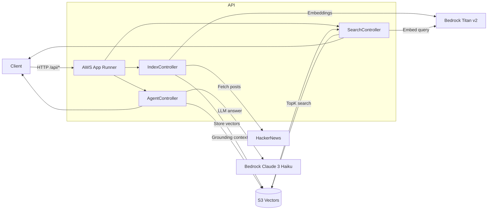

# .NET Vector Search with Multiple Providers

Semantic search API using vector embeddings with **Redis Stack**, **Qdrant**, and **AWS S3 Vectors**. Built on ASP.NET Core 8.0 and Semantic Kernel.

```
HTTP request → Controller → Semantic Kernel prompt → Bedrock model picks tools
→ SK calls C# plugin → tool result feeds back into completion → final answer
```

## Project Structure

```
VectorSearch.Core/                  # Shared abstractions & models
├── IVectorStore.cs, IVectorService.cs, IEmbeddingService.cs, IPostService.cs
├── IAgentAnswerService.cs
└── Models/                         # AgentAnswerResult, AgentAskRequest/Response, AgentSource

VectorSearch.S3/                    # AWS & Qdrant implementations
├── EmbeddingService.cs             # Bedrock Titan embeddings
├── MockEmbeddingService.cs         # Deterministic embeddings for local dev
├── S3VectorStore.cs, S3VectorService.cs, QdrantVectorStore.cs
├── HackerNewsService.cs            # Data source
├── GroundedAgentAnswerService.cs   # SK-based grounded answer agent
├── SemanticSearchPlugin.cs         # SK plugin for retrieval
├── IndexingPlugin.cs               # SK plugin for auto-indexing
├── ToolInvocationFilter.cs         # SK function invocation filter
├── VectorSearchOptionsValidator.cs
└── ServiceCollectionExtensions.cs

VectorSearch.Redis/                 # RedisVectorStore.cs
VectorSearch.Api/                   # Controllers (Agent, Index, Posts, Search) + thin Services
VectorSearch.IntegrationTests/      # 22 tests: 7 Theory×2 providers + 5 validator + 3 plugin
```

---

## Quick Start

**Prerequisites**: .NET 8.0 SDK, Docker Desktop, AWS account (S3 Vectors only)

```powershell
git clone https://github.com/msepahvand/dotnet-vector-search.git
cd dotnet-vector-search
docker-compose up          # starts Redis, Qdrant, and API
```

```powershell
curl http://localhost:5000/api/posts                          # fetch posts
curl -X POST http://localhost:5000/api/index/all              # index all posts
curl "http://localhost:5000/api/search?query=test&topK=5"     # search
curl -X POST http://localhost:5000/api/agent/ask \
  -H "Content-Type: application/json" \
  -d '{"question":"What are the top posts about?","topK":5}'  # agentic ask
```

```powershell
cd VectorSearch.IntegrationTests && dotnet test               # run tests
```

**UIs**: RedisInsight http://localhost:8001 · Qdrant Dashboard http://localhost:6333/dashboard

---

## Architecture



### Semantic Kernel Integration

| Capability | Implementation |
|---|---|
| **Embeddings** | `EmbeddingService` — Bedrock Titan via `IEmbeddingGenerator` |
| **Chat Completion** | `GroundedAgentAnswerService` — Bedrock Claude via `IChatCompletionService` |
| **Auto Function Calling** | `FunctionChoiceBehavior.Auto()` — model picks which plugin to call |
| **Plugins** | `SemanticSearchPlugin` (retrieval), `IndexingPlugin` (auto-index on first ask) |
| **Invocation Filter** | `ToolInvocationFilter` — logs calls, normalizes topK, enforces guardrails |

---

## Vector Store Providers

| | Redis | Qdrant | S3 Vectors |
|---|---|---|---|
| **Best for** | Local dev | Testing / dedicated vector DB | Production |
| **Algorithm** | HNSW | HNSW | Proprietary |
| **Latency** | Microseconds | Milliseconds | Milliseconds |
| **Scaling** | Vertical | Horizontal | Auto |
| **Setup** | Docker | Docker | AWS account |
| **UI** | RedisInsight (:8001) | Dashboard (:6333) | AWS Console |

### Configuration

Switch providers via `appsettings.json` or environment variables:

```jsonc
// appsettings.json — S3 Vectors (production default)
{ "VectorStore": { "Provider": "S3Vectors" },
  "AWS": { "Region": "us-east-1", "VectorBucketName": "posts-semantic-search",
           "VectorIndexName": "posts-content-index", "EmbeddingModelId": "amazon.titan-embed-text-v2:0" } }

// appsettings.Development.json — Qdrant
{ "VectorStore": { "Provider": "Qdrant", "Qdrant": { "Url": "http://localhost:6333",
  "CollectionName": "posts", "VectorSize": 1024 } } }

// appsettings.Redis.json — Redis
{ "VectorStore": { "Provider": "Redis", "Redis": { "ConnectionString": "localhost:6379",
  "IndexName": "posts_idx", "VectorSize": "1024" } } }
```

Or via env vars: `$env:VectorStore__Provider="Qdrant"`, etc.

---

## API Endpoints

| Method | Route | Description |
|--------|-------|-------------|
| GET | `/api/posts` | Fetch posts from HackerNews |
| GET | `/api/posts/{id}` | Fetch a single post |
| POST | `/api/index/all` | Index all posts with embeddings |
| POST | `/api/index/{id}` | Index a single post |
| GET | `/api/search?query=<text>&topK=<n>` | Semantic search (default topK=10) |
| POST | `/api/agent/ask` | Agentic grounded answer (`{ "question": "...", "topK": 5 }`) |

The agent endpoint auto-indexes if the vector store is empty, runs semantic search via SK plugin, and returns a grounded answer with `[PostId: N]` citations.

---

## Testing

**22 tests** — xUnit + Testcontainers + WebApplicationFactory:

| Tests | Scope |
|-------|-------|
| 7 Theory × 2 providers (Qdrant + Redis) | End-to-end API: posts, indexing, search, error handling |
| 5 Fact | Options validator unit tests |
| 2 Fact | IndexingPlugin: auto-index + skip-when-populated |
| 1 Fact | SemanticSearchPlugin round-trip |

```powershell
dotnet test                                                   # all tests
dotnet test --filter "GetPosts_ReturnsSuccessAndPosts"         # single test
dotnet test --filter "provider=Redis"                          # single provider
```

---

## Deployment

### Docker

```powershell
docker build -t vectorsearch-api -f VectorSearch.Api/Dockerfile .
docker run -p 8080:8080 vectorsearch-api
```

### CI/CD (GitHub Actions)

`.github/workflows/ci-cd.yml` runs on push/PR to `main`/`master`:

1. **Build & Test** — builds solution, runs all tests
2. **Infrastructure** — Terraform apply (`infra/`) → S3 Vectors, ECR, App Runner
3. **Deploy** — Docker build → ECR push → App Runner update

Auth: **OIDC role assumption** (no static keys). Images tagged `<sha>-<run>-<attempt>`.

**Required secrets**:

| Secret | Required | Notes |
|--------|----------|-------|
| `AWS_INFRA_ROLE_ARN` | Yes | OIDC role for Terraform + deploy |
| `AWS_ACCOUNT_ID` | Yes | For ECR URI |
| `AWS_REGION` | No | Defaults to `us-east-1` |
| `ECR_REPOSITORY` | No | Defaults to `dotnet-vector-search` |
| `APP_RUNNER_SERVICE_NAME` | No | Defaults to `dotnet-vector-search` |
| `APP_RUNNER_SERVICE_ARN` | No | Auto-resolved from name |
| `APP_RUNNER_ECR_ACCESS_ROLE_ARN` | New service only | ECR pull role |
| `APP_RUNNER_INSTANCE_ROLE_ARN` | New service only | Bedrock/S3 Vectors access |

### Destroy

`.github/workflows/destroy-infra.yml` — `workflow_dispatch` with `DESTROY` confirmation. Resilient to re-runs on already-deleted infrastructure.

---

## AWS S3 Vectors Setup

1. **Create S3 Vector Bucket** (not regular S3) — name: `posts-semantic-search`
2. **Create vector index** — name: `posts-content-index`, dimensions: **1024**, distance: **cosine**
3. **Enable Bedrock model** — `amazon.titan-embed-text-v2:0` in Bedrock console
4. **Configure credentials** — `aws configure` or IAM role
5. **Test**:
   ```powershell
   dotnet run --project VectorSearch.Api
   curl -X POST http://localhost:5000/api/index/all
   curl "http://localhost:5000/api/search?query=technology&topK=10"
   ```

**Cost**: ~$0.01 to index 100 posts (Bedrock embeddings + S3 Vectors storage).

---

## Troubleshooting

| Problem | Fix |
|---------|-----|
| Can't connect to Docker | Ensure Docker Desktop is running |
| Port already in use | `docker-compose down` or change ports |
| Tests timing out | Check Docker resources (memory/CPU) |
| Container startup failure | `docker pull qdrant/qdrant:latest` / `redis/redis-stack:latest` |
| AWS "Access Denied" | `aws sts get-caller-identity`, verify IAM + Bedrock model access |
| AWS "Bucket not found" | Confirm it's an S3 **Vector Bucket**, check region |
| Empty search results | Index posts first (`POST /api/index/all`), verify dimensions = 1024 |

---

## Resources

- [Semantic Kernel](https://learn.microsoft.com/en-us/semantic-kernel/) · [AWS S3 Vectors](https://docs.aws.amazon.com/AmazonS3/latest/userguide/s3-vectors.html) · [Amazon Bedrock](https://docs.aws.amazon.com/bedrock/) · [Redis Vector Search](https://redis.io/docs/interact/search-and-query/advanced-concepts/vectors/) · [Qdrant](https://qdrant.tech/documentation/) · [Testcontainers .NET](https://dotnet.testcontainers.org/)