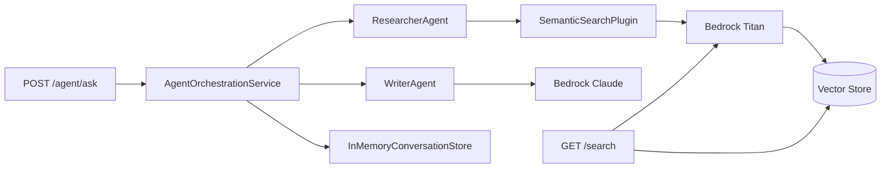

# .NET RAG Agent with Multiple Vector Store Providers

Retrieval-augmented generation (RAG) API using a Researcher + Writer multi-agent pattern, vector embeddings, and pluggable vector store backends. Built on ASP.NET Core 8.0 and Semantic Kernel.

```
POST /api/agent/ask
  → AgentOrchestrationService
    → ResearcherAgent (SemanticSearchPlugin → vector store)
    → WriterAgent (Bedrock Claude → grounded answer + citations)
  → persisted to InMemoryConversationStore
```

## Project Structure

```
VectorSearch.Core/                  # Provider-agnostic contracts
├── IVectorStore.cs, IVectorService.cs, IEmbeddingService.cs
├── IPostService.cs, IAgentAnswerService.cs, IConversationStore.cs
└── Models/                         # Post, ChatMessage, AgentAnswerResult, ConversationEvent, AgentSource

VectorSearch.S3/                    # AWS + Qdrant implementations
├── Agents/
│   ├── ResearcherAgent.cs          # Runs SemanticSearchPlugin, returns sources
│   └── WriterAgent.cs              # Synthesises sources → grounded answer via Bedrock Claude
├── MultiAgentAnswerService.cs      # Orchestrates Researcher → Writer
├── EmbeddingService.cs             # Bedrock Titan via IEmbeddingGenerator (Channel-based streaming)
├── SemanticSearchPlugin.cs         # SK plugin: embed query → vector search → enrich snippets
├── IndexingPlugin.cs               # SK plugin: auto-index if vector store is empty
├── ToolInvocationFilter.cs         # SK invocation filter: logging + topK normalisation
├── S3VectorStore.cs, S3VectorService.cs, QdrantVectorStore.cs
├── HackerNewsService.cs
└── VectorSearchOptionsValidator.cs

VectorSearch.Redis/                 # RedisVectorStore.cs
VectorSearch.Api/                   # Controllers + thin services
├── Controllers/                    # Agent, Conversations, Index, Posts, Search
├── Services/
│   ├── AgentOrchestrationService.cs    # Loads history, calls IAgentAnswerService, persists messages
│   ├── InMemoryConversationStore.cs    # Singleton; exposes Subscribe() → IAsyncEnumerable<ConversationEvent>
│   ├── PostIndexingService.cs          # Streams embeddings with backpressure (max 3 concurrent)
│   ├── PostsQueryService.cs
│   └── SemanticSearchService.cs
VectorSearch.IntegrationTests/      # 24 tests
```

---

## Quick Start

**Prerequisites**: .NET 8.0 SDK, Docker Desktop, AWS account (S3 Vectors only)

```powershell
git clone https://github.com/msepahvand/dotnet-rag-agent.git
cd dotnet-rag-agent
docker-compose up          # starts Redis, Qdrant, and API
```

```powershell
curl http://localhost:5000/api/posts                          # fetch posts
curl -X POST http://localhost:5000/api/index/all              # index all posts
curl "http://localhost:5000/api/search?query=test&topK=5"     # semantic search
curl -X POST http://localhost:5000/api/agent/ask \
  -H "Content-Type: application/json" \
  -d '{"question":"What are the top posts about?","topK":5}'  # RAG agent ask
```

```powershell
dotnet test VectorSearch.IntegrationTests                     # run tests
```

**UIs**: RedisInsight http://localhost:8001 · Qdrant Dashboard http://localhost:6333/dashboard

---

## Architecture



### Semantic Kernel Integration

| Capability | Implementation |
|---|---|
| **Embeddings** | `EmbeddingService` — Bedrock Titan via `IEmbeddingGenerator`, Channel-based streaming with backpressure |
| **Research** | `ResearcherAgent` — invokes `SemanticSearchPlugin` to retrieve and enrich sources |
| **Answer synthesis** | `WriterAgent` — Bedrock Claude via `IChatCompletionService`, structured JSON output (answer + citations + grounded flag) |
| **Orchestration** | `MultiAgentAnswerService` → `AgentOrchestrationService` (history load/persist) |
| **Plugins** | `SemanticSearchPlugin` (retrieval), `IndexingPlugin` (auto-index on first ask) |
| **Invocation Filter** | `ToolInvocationFilter` — logs calls, normalises topK, enforces guardrails |

---

## Vector Store Providers

| | Redis | Qdrant | S3 Vectors |
|---|---|---|---|
| **Best for** | Local dev | Testing / dedicated vector DB | Production |
| **Algorithm** | HNSW | HNSW | Proprietary |
| **Latency** | Microseconds | Milliseconds | Milliseconds |
| **Scaling** | Vertical | Horizontal | Auto |
| **Setup** | Docker | Docker | AWS account |
| **UI** | RedisInsight (:8001) | Dashboard (:6333) | AWS Console |

### Configuration

Switch providers via `appsettings.json` or environment variables:

```jsonc
// appsettings.json — S3 Vectors (production default)
{ "VectorStore": { "Provider": "S3Vectors" },
  "AWS": { "Region": "us-east-1", "VectorBucketName": "posts-semantic-search",
           "VectorIndexName": "posts-content-index", "EmbeddingModelId": "cohere.embed-english-v3",
           "ChatModelId": "us.anthropic.claude-sonnet-4-6" } }

// appsettings.Development.json — Qdrant
{ "VectorStore": { "Provider": "Qdrant", "Qdrant": { "Url": "http://localhost:6333",
  "CollectionName": "posts", "VectorSize": 1024 } } }

// appsettings.Redis.json — Redis
{ "VectorStore": { "Provider": "Redis", "Redis": { "ConnectionString": "localhost:6379",
  "IndexName": "posts_idx", "VectorSize": "1024" } } }
```

Or via env vars: `$env:VectorStore__Provider="Qdrant"`, etc.

---

## API Endpoints

| Method | Route | Description |
|--------|-------|-------------|
| GET | `/api/posts` | Fetch posts from HackerNews |
| GET | `/api/posts/{id}` | Fetch a single post |
| POST | `/api/index/all` | Index all posts with embeddings |
| POST | `/api/index/{id}` | Index a single post |
| GET | `/api/search?query=<text>&topK=<n>` | Semantic search (default topK=10) |
| POST | `/api/agent/ask` | RAG agent ask (`{ "question": "...", "topK": 5, "conversationId": "..." }`) |
| GET | `/api/agent/conversations` | List all conversation IDs |
| GET | `/api/agent/conversations/{id}` | Get full message history for a conversation |
| DELETE | `/api/agent/conversations/{id}` | Delete a conversation |

The agent endpoint auto-indexes if the vector store is empty, runs semantic retrieval via `ResearcherAgent`, and returns a grounded answer with `[PostId: N]` citations. Conversation history is maintained per `conversationId` for multi-turn context.

---

## Testing

**24 tests** — xUnit + Testcontainers + WebApplicationFactory:

| Tests | Scope |
|-------|-------|
| 7 Theory × 2 providers (Qdrant + Redis) | End-to-end API: posts, indexing, search, error handling |
| 5 Fact | Options validator unit tests |
| 2 Fact | IndexingPlugin: auto-index + skip-when-populated |
| 1 Fact | SemanticSearchPlugin round-trip |

```powershell
dotnet test                                                   # all tests
dotnet test --filter "GetPosts_ReturnsSuccessAndPosts"         # single test
dotnet test --filter "provider=Redis"                          # single provider
```

---

## Deployment

### Docker

```powershell
docker build -t rag-agent-api -f VectorSearch.Api/Dockerfile .
docker run -p 8080:8080 rag-agent-api
```

### CI/CD (GitHub Actions)

`.github/workflows/ci-cd.yml` runs on push/PR to `main`/`master`:

1. **Build & Test** — builds solution, runs all tests
2. **Infrastructure** — Terraform apply (`infra/`) → S3 Vectors, ECR, App Runner
3. **Deploy** — Docker build → ECR push → App Runner update

Auth: **OIDC role assumption** (no static keys). Images tagged `<sha>-<run>-<attempt>`.

**Required secrets**:

| Secret | Required | Notes |
|--------|----------|-------|
| `AWS_INFRA_ROLE_ARN` | Yes | OIDC role for Terraform + deploy |
| `AWS_ACCOUNT_ID` | Yes | For ECR URI |
| `AWS_REGION` | No | Defaults to `us-east-1` |
| `ECR_REPOSITORY` | No | Defaults to `dotnet-rag-agent` |
| `APP_RUNNER_SERVICE_NAME` | No | Defaults to `dotnet-rag-agent` |
| `APP_RUNNER_SERVICE_ARN` | No | Auto-resolved from name |
| `APP_RUNNER_ECR_ACCESS_ROLE_ARN` | New service only | ECR pull role |
| `APP_RUNNER_INSTANCE_ROLE_ARN` | New service only | Bedrock/S3 Vectors access |

### Destroy

`.github/workflows/destroy-infra.yml` — `workflow_dispatch` with `DESTROY` confirmation. Resilient to re-runs on already-deleted infrastructure.

---

## AWS S3 Vectors Setup

1. **Create S3 Vector Bucket** (not regular S3) — name: `posts-semantic-search`
2. **Create vector index** — name: `posts-content-index`, dimensions: **1024**, distance: **cosine**
3. **Enable Bedrock models** — `cohere.embed-english-v3` and `us.anthropic.claude-sonnet-4-6` in Bedrock console
4. **Configure credentials** — `aws configure` or IAM role
5. **Test**:
   ```powershell
   dotnet run --project VectorSearch.Api
   curl -X POST http://localhost:5000/api/index/all
   curl "http://localhost:5000/api/search?query=technology&topK=10"
   curl -X POST http://localhost:5000/api/agent/ask -H "Content-Type: application/json" \
     -d '{"question":"What are people saying about AI?","topK":5}'
   ```

**Cost**: ~$0.01 to index 100 posts (Bedrock embeddings + S3 Vectors storage).

---

## Troubleshooting

| Problem | Fix |
|---------|-----|
| Can't connect to Docker | Ensure Docker Desktop is running |
| Port already in use | `docker-compose down` or change ports |
| Tests timing out | Check Docker resources (memory/CPU) |
| Container startup failure | `docker pull qdrant/qdrant:latest` / `redis/redis-stack:latest` |
| AWS "Access Denied" | `aws sts get-caller-identity`, verify IAM + Bedrock model access |
| AWS "Bucket not found" | Confirm it's an S3 **Vector Bucket**, check region |
| Empty search results | Index posts first (`POST /api/index/all`), verify dimensions = 1024 |
| Invalid Bedrock model | Ensure model is enabled in your region's Bedrock console |

---

## Resources

- [Semantic Kernel](https://learn.microsoft.com/en-us/semantic-kernel/) · [AWS S3 Vectors](https://docs.aws.amazon.com/AmazonS3/latest/userguide/s3-vectors.html) · [Amazon Bedrock](https://docs.aws.amazon.com/bedrock/) · [Redis Vector Search](https://redis.io/docs/interact/search-and-query/advanced-concepts/vectors/) · [Qdrant](https://qdrant.tech/documentation/) · [Testcontainers .NET](https://dotnet.testcontainers.org/)
