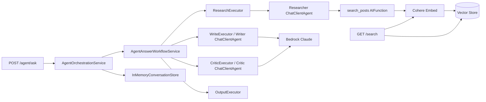
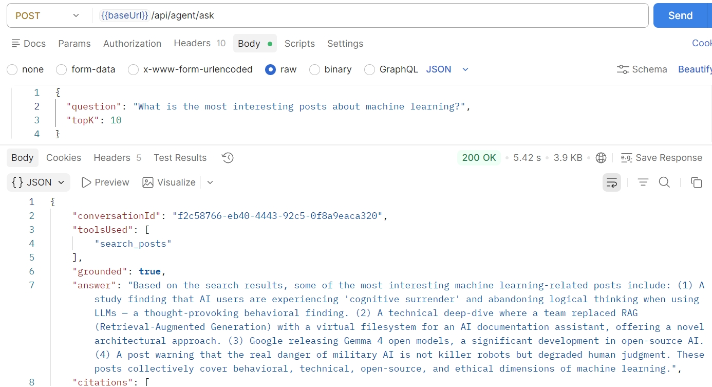

# .NET RAG Agent with Multiple Vector Store Providers

[](https://github.com/msepahvand/dotnet-rag-agent/actions/workflows/ci-cd.yml)

See the [documentation index](docs/README.md) for project guidance and modernisation plans.

Retrieval-augmented generation (RAG) API using Microsoft.Extensions.AI for Bedrock chat and embeddings, Microsoft Agent Framework for model-directed retrieval and workflow orchestration, and pluggable vector store backends. Built on ASP.NET Core 10.0.

```
POST /api/agent/ask          (batch — reviewed answer, ~10 s)
  → AgentOrchestrationService
    → AgentAnswerWorkflowService (MAF Workflow)
      → ResearchExecutor (Researcher ChatClientAgent → search_posts tool)
      → WriteExecutor    (Writer ChatClientAgent → draft answer + citations)
      → CriticExecutor   (Critic ChatClientAgent → approve or request revision)
      → OutputExecutor   (final grounded answer)
  → persisted to InMemoryConversationStore

POST /api/agent/ask/stream   (SSE streaming — lower latency, ~1 s to first token)
  → AgentStreamingService
      → ResearcherAgent  (Researcher ChatClientAgent → search_posts tool → vector store)
      → WriterAgent      (Bedrock Claude → token-by-token prose, no critic loop)
  → persisted to InMemoryConversationStore
```

## Project Structure

```
RagAgent.Core/                      # Provider-agnostic contracts
├── IVectorStore.cs, IVectorService.cs, IEmbeddingService.cs
├── IPostService.cs, IAgentAnswerService.cs, IConversationStore.cs
└── Models/                         # Post, ConversationMessage, AgentAnswerResult, ConversationEvent, AgentSource

RagAgent.Agents/                    # Model agents and orchestration
├── Workflow/                       # Microsoft Agent Framework workflow
│   ├── AgentAnswerWorkflowService.cs
│   └── *Executor.cs                # Research → Write → Critic → Output
├── ResearcherAgent.cs              # ChatClientAgent with bounded search_posts tool
├── WriterAgent.cs                  # Synthesises sources → grounded answer via Bedrock Claude
├── CriticAgent.cs                  # Reviews draft answer, approves or requests revision
├── EvaluationAgent.cs              # Runs question set and computes evaluation metrics
├── EmbeddingService.cs             # Cohere embed-english-v3 via IEmbeddingGenerator (Channel-based streaming)
├── SemanticSearchPlugin.cs         # embed query → vector search → enrich snippets
├── HackerNewsService.cs
└── VectorSearchOptionsValidator.cs

RagAgent.InMemory/                  # In-memory conversation store (30-minute TTL, 40-message cap)
RagAgent.AgentCore/                 # Durable AgentCore Memory conversation store (opt-in)
RagAgent.Redis/                     # RedisVectorStore.cs
RagAgent.Qdrant/                    # QdrantVectorStore.cs
RagAgent.S3Vectors/                 # S3VectorStore.cs and S3VectorService.cs
RagAgent.Api/                       # Controllers + thin services
├── Controllers/                    # Agent, Conversations, Evaluation, Index, Posts, Search
├── Services/
│   ├── AgentOrchestrationService.cs    # Loads history, calls IAgentAnswerService, persists messages
│   ├── IngestionBackgroundService.cs   # Polls HackerNews, indexes new posts automatically
│   ├── IngestionTracker.cs             # Tracks which post IDs have been indexed this process lifetime
│   ├── IndexingStartupService.cs       # Seeds IngestionTracker on startup
│   ├── PostIndexingService.cs          # Streams embeddings with backpressure (max 3 concurrent)
│   ├── PostsQueryService.cs
│   └── SemanticSearchService.cs
RagAgent.UnitTests/                 # Unit tests (business logic, orchestration, agents)
RagAgent.IntegrationTests/          # Integration tests (end-to-end API via Testcontainers)
```

---

## Quick Start

**Prerequisites**: .NET 10 SDK (version pinned in `global.json`), Docker for local vector stores and integration tests, and AWS credentials with Bedrock model access for chat and embeddings. S3 Vectors permissions are also required when using that provider.

```powershell
docker-compose up          # starts Redis, Qdrant, and API
```

```powershell
Invoke-RestMethod http://localhost:5000/api/posts
Invoke-RestMethod -Method Post http://localhost:5000/api/index/all
Invoke-RestMethod "http://localhost:5000/api/search?query=test&topK=5"
Invoke-RestMethod -Method Post `
  -Uri http://localhost:5000/api/agent/ask `
  -ContentType "application/json" `
  -Body '{"question":"What are the top posts about?","topK":5}'
```

```powershell
dotnet test RagAgent.IntegrationTests                         # run tests
```

**UIs**: RedisInsight http://localhost:8001 · Qdrant Dashboard http://localhost:6333/dashboard

---

## Architecture


```mermaid
flowchart LR
  A[POST /agent/ask] --> ORC[AgentOrchestrationService]
  ORC --> PAS[AgentAnswerWorkflowService]
  PAS --> RS[ResearchExecutor]
  RS --> RA[Researcher ChatClientAgent]
  RA --> SP[search_posts AIFunction]
  SP --> BRT[Cohere Embed]
  BRT --> VS[(Vector Store)]
  PAS --> WS[WriteExecutor / Writer ChatClientAgent]
  WS --> BRC[Bedrock Claude]
  PAS --> CS2[CriticExecutor / Critic ChatClientAgent]
  CS2 --> BRC
  PAS --> OS[OutputExecutor]
  ORC --> CS[InMemoryConversationStore]

  SC[GET /search] --> BRT
  SC --> VS
```

### Model and process integration

| Capability | Implementation |
|---|---|
| **Chat** | Researcher, writer and critic use MAF `ChatClientAgent` over Bedrock Converse via MEAI `IChatClient` |
| **Embeddings** | `EmbeddingService` — Cohere embed-english-v3 via `IEmbeddingGenerator`, Channel-based streaming with backpressure |
| **Research** | `ResearcherAgent` — MAF `ChatClientAgent` calls a bounded `search_posts` function; multiple searches are merged and direct search is the no-tool fallback |
| **Answer synthesis** | `WriterAgent` — MAF `ChatClientAgent` over MEAI, structured JSON output (answer + citations + grounded flag) |
| **Critique** | `CriticAgent` — MAF `ChatClientAgent` reviews each draft; approves or requests a revision |
| **Evaluation** | `EvaluationAgent` — scores hit@k, citation validity, latency and writer-reported groundedness; optional independent groundedness/relevance judges |
| **Orchestration** | `AgentOrchestrationService` loads/persists history around `AgentAnswerWorkflowService` (MAF Workflow); third draft bypasses the critic |
| **Search/indexing services** | `SemanticSearchPlugin` (retrieval), `PostIndexingService` (indexing) |

Chat and embedding model access use Microsoft.Extensions.AI. Researcher, writer and critic are Microsoft Agent Framework `ChatClientAgent`s, and the batch answer pipeline is a typed MAF Workflow. Guardrails run in `GuardrailsService` at the request boundary.

---

## Vector Store Providers

| | Redis | Qdrant | S3 Vectors |
|---|---|---|---|
| **Best for** | Local dev | Testing / dedicated vector DB | Production |
| **Algorithm** | HNSW | HNSW | Proprietary |
| **Latency** | Microseconds | Milliseconds | Milliseconds |
| **Scaling** | Vertical | Horizontal | Auto |
| **Setup** | Docker | Docker | AWS account |
| **UI** | RedisInsight (:8001) | Dashboard (:6333) | AWS Console |

### Configuration

Switch providers via `appsettings.json` or environment variables:

**appsettings.json** — S3 Vectors (production default)
```json
{
  "VectorStore": { "Provider": "S3Vectors" },
  "AWS": {
    "Region": "us-east-1",
    "VectorBucketName": "posts-semantic-search",
    "VectorIndexName": "posts-content-index",
    "EmbeddingModelId": "cohere.embed-english-v3",
    "ChatModelId": "us.anthropic.claude-sonnet-4-6"
  }
}
```

**appsettings.Development.json** — Qdrant
```json
{
  "VectorStore": {
    "Provider": "Qdrant",
    "Qdrant": { "Url": "http://localhost:6333", "CollectionName": "posts", "VectorSize": 1024 }
  }
}
```

**appsettings.Redis.json** — Redis
```json
{
  "VectorStore": {
    "Provider": "Redis",
    "Redis": { "ConnectionString": "localhost:6379", "IndexName": "posts_idx", "VectorSize": "1024" }
  }
}
```

Or via env vars: `$env:VectorStore__Provider="Qdrant"`, etc.

Conversation history uses the in-memory store by default. Production can opt into AgentCore Memory with `ConversationStore__Provider=AgentCore` and `ConversationStore__AgentCore__MemoryId=<memory-id>`; Terraform provisions the resource and configures the ECS task. AgentCore conversations retain the existing 30-minute logical expiry and 40-message cap; a 15-minute background sweep deletes expired events even when the unauthenticated listing endpoint is disabled. Keep `Conversations__ListEnabled=false` until conversation listing is scoped to authenticated users.

---

## API Endpoints

| Method | Route | Description |
|--------|-------|-------------|
| GET | `/api/posts` | Fetch posts from HackerNews |
| GET | `/api/posts/{id}` | Fetch a single post |
| POST | `/api/index/all` | Index all posts with embeddings |
| POST | `/api/index/{id}` | Index a single post |
| GET | `/api/search?query=<text>&topK=<n>` | Semantic search (default topK=10) |
| POST | `/api/agent/ask` | RAG agent ask — Research → Write → Critic/revise workflow, structured response with citations |
| POST | `/api/agent/ask/stream` | Streaming RAG ask — Server-Sent Events (SSE); skips critic loop for lower latency. Event types: `status`, `sources`, `token`, `done`, `error` |
| POST | `/api/agent/evaluate` | Run evaluation question set, returns hit@k / groundedness / citation metrics |
| GET | `/api/agent/conversations` | List all conversation IDs |
| GET | `/api/agent/conversations/{id}` | Get full message history for a conversation |
| DELETE | `/api/agent/conversations/{id}` | Delete a conversation |

The agent endpoints auto-index if the vector store is empty and maintain conversation history per `conversationId` for multi-turn context.

Post titles and bodies are embedded as overlapping chunks of up to 2,048 characters, so long posts are indexed in full rather than truncated. Search ranks matching chunks and returns each post only once. Clear or recreate an existing vector index before the first chunked reindex; old post-level vectors are not migrated or removed automatically.

**Choosing between batch and streaming:**

| | `POST /ask` | `POST /ask/stream` |
|---|---|---|
| **Latency** | ~10 s total | ~1 s to first token |
| **Model work** | Research tool selection + writer + critic (and optional rewrite) | Research tool selection + streaming writer; no critic |
| **Output format** | JSON with citations and grounded flag | SSE token stream, sources in `done` event |
| **Use when** | Citation quality matters | Chat UI, real-time feedback |



---

## Deployment

### Docker

```powershell
docker build -t rag-agent-api -f RagAgent.Api/Dockerfile .
docker run -p 8080:8080 rag-agent-api
```

### CI/CD (GitHub Actions)

`.github/workflows/ci-cd.yml` runs build, format verification and unit/integration tests on pull requests and pushes to `main`/`master`. Infrastructure and deployment run only on pushes to those branches when the commit includes non-Markdown changes:

1. **Build & Test** — builds solution, runs all tests
2. **Deploy infrastructure** — Terraform apply (`infra/`) provisions ECS, ECR, ALB and S3 Vectors
3. **Deploy to ECS** — builds and pushes an `amd64`/`arm64` image, then updates the ECS service

Auth: **OIDC role assumption** (no static keys). Images are tagged `<sha>-<run>-<attempt>`.

**GitHub Actions secrets**:

| Secret | Required | Notes |
|--------|----------|-------|
| `AWS_INFRA_ROLE_ARN` | Yes | OIDC role assumed by infrastructure and deployment jobs |
| `AWS_REGION` | No | Defaults to `us-east-1` |
| `ECR_REPOSITORY` | No | Defaults to `dotnet-rag-agent` |
| `ECS_CLUSTER_NAME` | No | Defaults to `dotnet-rag-agent` |
| `ECS_SERVICE_NAME` | No | Defaults to `dotnet-rag-agent` |

### Destroy

`.github/workflows/destroy-infra.yml` — `workflow_dispatch` with `DESTROY` confirmation. Resilient to re-runs on already-deleted infrastructure.

---

## AWS S3 Vectors Setup

1. **Create S3 Vector Bucket** (not regular S3) — name: `posts-semantic-search`
2. **Create vector index** — name: `posts-content-index`, dimensions: **1024**, distance: **cosine**
3. **Enable Bedrock models** — `cohere.embed-english-v3` and `us.anthropic.claude-sonnet-4-6` in Bedrock console
4. **Configure credentials** — `aws configure` or IAM role
5. **Test**:
   ```powershell
   dotnet run --project RagAgent.Api
   curl -X POST http://localhost:5000/api/index/all
   curl "http://localhost:5000/api/search?query=technology&topK=10"
   curl -X POST http://localhost:5000/api/agent/ask -H "Content-Type: application/json" \
     -d '{"question":"What are people saying about AI?","topK":5}'
   ```

**Cost**: ~$0.01 to index 100 posts (Bedrock embeddings + S3 Vectors storage).

---

## Troubleshooting

| Problem | Fix |
|---------|-----|
| Can't connect to Docker | Ensure Docker Desktop is running |
| Port already in use | `docker-compose down` or change ports |
| Tests timing out | Check Docker resources (memory/CPU) |
| Container startup failure | `docker pull qdrant/qdrant:latest` / `redis/redis-stack:latest` |
| AWS "Access Denied" | `aws sts get-caller-identity`, verify IAM + Bedrock model access |
| AWS "Bucket not found" | Confirm it's an S3 **Vector Bucket**, check region |
| Empty search results | Index posts first (`POST /api/index/all`), verify dimensions = 1024 |
| Invalid Bedrock model | Ensure model is enabled in your region's Bedrock console |

---

## Observability

The API is instrumented with OpenTelemetry. Traces are exported via OTLP and can be viewed in Jaeger locally or AWS X-Ray in production.

### Local (Jaeger)

Jaeger runs as part of `docker-compose up` and is available at **http://localhost:16686**.

Select service **`rag-agent`** in the Jaeger UI to see traces. Each agent request produces a span covering the full pipeline:

| Span | Emitted by |
|------|------------|
| `agent.ask` | `POST /api/agent/ask` — batch pipeline |
| `agent.stream` | `POST /api/agent/ask/stream` — streaming pipeline |

Span tags available on both spans:

| Tag | Description |
|-----|-------------|
| `conversation.id` | Conversation the request belongs to |
| `rag.top_k` | Number of sources requested from the vector store |
| `rag.grounded` | Whether the answer was grounded in retrieved sources |

Additional tags on `agent.ask`: `rag.iterations`, `rag.citations_count`, `rag.tools_used`.  
Additional tag on `agent.stream`: `rag.sources_count`.

### Production (AWS X-Ray)

In production, an **ADOT (AWS Distro for OpenTelemetry) Collector** sidecar runs alongside the ECS Fargate task. It receives traces from the API container over OTLP (port 4317) and forwards them to AWS X-Ray.

To view traces:

1. Open the [AWS X-Ray console](https://console.aws.amazon.com/xray/home) and select your region
2. Go to **Traces** → search by service name **`rag-agent`**
3. Use **Service Map** to see the full call graph including downstream Bedrock calls

The ADOT collector config lives in [infra/otel-collector-config.yaml](infra/otel-collector-config.yaml) and is injected into the ECS task definition as the `AOT_CONFIG_CONTENT` environment variable by [scripts/deploy-ecs.sh](scripts/deploy-ecs.sh).

---

## Resources

- [Microsoft.Extensions.AI](https://learn.microsoft.com/en-us/dotnet/ai/microsoft-extensions-ai) · [Microsoft Agent Framework](https://learn.microsoft.com/en-us/agent-framework/overview/) · [AWS S3 Vectors](https://docs.aws.amazon.com/AmazonS3/latest/userguide/s3-vectors.html) · [Amazon Bedrock](https://docs.aws.amazon.com/bedrock/) · [Redis Vector Search](https://redis.io/docs/interact/search-and-query/advanced-concepts/vectors/) · [Qdrant](https://qdrant.tech/documentation/) · [Testcontainers .NET](https://dotnet.testcontainers.org/)
